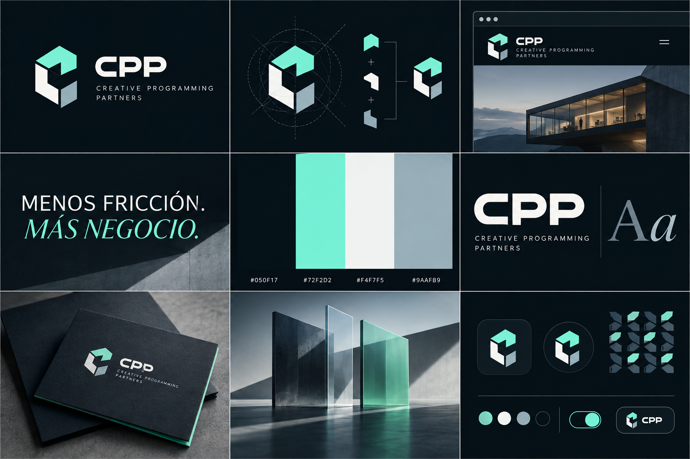

# CPP — Sistema de marca inicial

> Estado: prototipo v1 · Creative Programming Partners

## Esencia

**Qué somos**  
CPP es un estudio digital que diseña y desarrolla sitios web, productos digitales y automatizaciones para que los negocios vendan mejor y operen con menos fricción.

**Posicionamiento**  
Para empresas que necesitan algo más útil que una web decorativa, CPP convierte objetivos comerciales y procesos complejos en experiencias digitales claras, medibles y bien construidas.

**Idea rectora**  
**Tres perspectivas. Un mismo flujo.**

El símbolo está formado por tres módulos independientes. Juntos construyen una figura estable, dejan una **C** abierta en el espacio negativo y sugieren avance. Cada módulo representa a uno de los socios; la figura completa representa el sistema que crean al trabajar como uno solo.

**Promesa principal**  
Menos fricción. Más negocio.

## Personalidad

- Precisa, sin sentirse fría.
- Inventiva, sin volverse extravagante.
- Técnica, explicada con lenguaje humano.
- Segura, sin exagerar resultados.
- Colaborativa: el cliente forma parte de las decisiones.

## Logotipo

### Archivos

- `assets/brand/cpp-symbol-dark.svg`: símbolo para fondos oscuros.
- `assets/brand/cpp-symbol-light.svg`: símbolo para fondos claros.
- `assets/brand/cpp-logo-horizontal-dark.svg`: firma completa para fondos oscuros.
- `assets/brand/cpp-logo-horizontal-light.svg`: firma completa para fondos claros.
- `assets/brand/cpp-social-avatar.svg`: avatar cuadrado para perfiles.
- `assets/brand/cpp-social-cover.svg`: portada social 1200 × 630.
- `assets/brand/png/`: exportaciones raster listas para publicar.

### Reglas de uso

- Mantener un área libre alrededor de la marca equivalente al ancho de uno de sus módulos.
- Tamaño mínimo recomendado del símbolo: **24 px** en digital y **8 mm** en impresión.
- Tamaño mínimo de la firma horizontal: **160 px** en digital y **42 mm** en impresión.
- No rotar, inclinar, estirar, añadir sombras ni cambiar los colores por separado.
- Sobre fotografía, colocar la marca únicamente en una zona limpia y con contraste AA como mínimo.
- Para aplicaciones monocromáticas, usar todo el símbolo en Obsidian Navy o Cloud, nunca grises distintos por módulo.

## Color

| Nombre | HEX | RGB | Uso principal |
|---|---:|---:|---|
| Obsidian Navy | `#050F17` | 5, 15, 23 | Fondo, texto principal, autoridad |
| Signal Mint | `#72F2D2` | 114, 242, 210 | Acción, enfoque, módulo distintivo |
| Cloud | `#F4F7F5` | 244, 247, 245 | Superficies claras y texto invertido |
| Steel | `#9AAFB9` | 154, 175, 185 | Información secundaria y tercer módulo |
| Deep Mint | `#28C9A8` | 40, 201, 168 | Sustituto accesible del mint sobre claro |
| Slate | `#607985` | 96, 121, 133 | Texto secundario sobre claro |

**Proporción recomendada:** 70% Obsidian/Cloud, 20% tonos neutrales, 10% Signal Mint.

## Tipografía

**Principal: Plus Jakarta Sans**  
Usar 700–800 para titulares, 500–600 para navegación y controles, y 400–500 para lectura. Es la voz precisa y contemporánea de la marca.

**Acento editorial: Georgia Italic**  
Reservarla para una frase corta, una palabra emocional o el remate del lema. Nunca usarla en párrafos, botones o interfaces.

## Voz

La marca habla con claridad comercial y evidencia. Primero explica el resultado; después, la tecnología.

**Sí:** “Creamos un sistema de reservas que reduce coordinación manual.”  
**No:** “Revolucionamos sin límites el futuro digital de tu ecosistema.”

### Mensajes iniciales

- **Descriptor:** Estudio de producto digital, web y automatización.
- **Lema principal:** Menos fricción. Más negocio.
- **Línea de cultura:** Tres perspectivas. Un mismo flujo.
- **Presentación corta:** Diseñamos y desarrollamos experiencias digitales que ayudan a vender, operar y crecer.

## Dirección visual

- Arquitectura contemporánea, sistemas modulares, vidrio, metal mate y sombras precisas.
- Composiciones con espacio negativo y uno o dos puntos de tensión, no collages saturados.
- Interfaces reales y legibles; evitar mockups futuristas imposibles.
- Movimiento basado en ensamblaje: los tres módulos pueden entrar por separado y cerrar la figura en 500–700 ms.
- Microinteracciones suaves, con respeto por `prefers-reduced-motion`.

## Kit mínimo de lanzamiento

- [x] Símbolo vectorial para fondo claro y oscuro.
- [x] Firma horizontal para fondo claro y oscuro.
- [x] Avatar social.
- [x] Portada social/Open Graph.
- [x] Paleta, tipografía, tono y reglas básicas.
- [x] Tablero de dirección artística.
- [x] Exportaciones PNG en 512, 1024 y 2048 px.
- [ ] Plantilla de propuesta comercial y cotización.
- [ ] Firma de correo para los tres socios.
- [ ] Plantillas de publicación para LinkedIn e Instagram.
- [ ] Registro de dominio, usuarios sociales y correo corporativo.
- [ ] Búsqueda de similitud y registro de marca en los países donde operará CPP.

## Originalidad y validación

Este concepto fue desarrollado específicamente desde el nombre, los tres socios y la propuesta comercial de CPP; no parte de un logotipo famoso ni de símbolos comunes de programación. Aun así, “original” no equivale a exclusividad legal. Antes de adoptarlo como marca definitiva se recomienda una búsqueda profesional de similitud gráfica y denominativa, además de verificar dominios y nombres de usuario.

## Próximo hito recomendado

Validar este prototipo en tres contextos reales —cabecera web, propuesta comercial y avatar pequeño— y recoger una sola ronda de comentarios de los tres socios. Después se congela la geometría, se convierten las letras del wordmark a curvas y se preparan los archivos maestros para registro e impresión.
